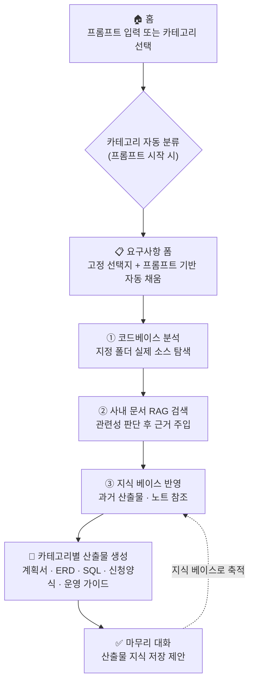
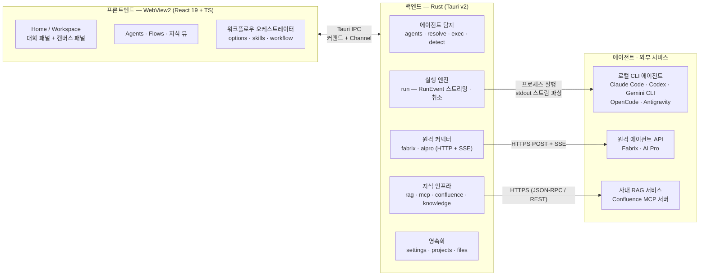

<div align="center">

# 🧙 Operation Wizard

**AI 코딩 에이전트 기반 운영 업무 워크스페이스**

로컬 CLI · 원격 API 에이전트를 자동 탐지·연결하고,
대화 + 캔버스 워크스페이스에서 **요구사항 확인 → 코드베이스 분석 → 사내 지식 반영 → 산출물 생성**까지
운영 업무를 단계별로 안내하는 Windows 데스크톱 앱입니다.

`Windows` · `Tauri v2` · `Rust` · `React 19` · `TypeScript` · `Tailwind CSS v4`

제작: **Samsung SDS** · 버전 `1.0.0`

</div>

---

## 목차

- [소개](#소개)
- [주요 기능](#주요-기능)
- [업무 진행 흐름](#업무-진행-흐름)
- [시스템 구성](#시스템-구성)
- [기술 스택](#기술-스택)
- [로컬 빌드 방법](#로컬-빌드-방법)
- [Rust 빌드 시 주의사항](#rust-빌드-시-주의사항)
- [데이터 저장 위치](#데이터-저장-위치)
- [문서](#문서)

---

## 소개

Operation Wizard는 운영 담당자가 **AI 에이전트를 활용해 실제 운영 업무를 수행**할 수 있도록 설계된
데스크톱 도구입니다. 단순한 채팅 클라이언트가 아니라, 업무 카테고리별로 검증된 절차(워크플로우)를
따라가며 **근거 있는 산출물**(분석서 · 계획서 · ERD · SQL · 신청양식 · 운영 가이드)을 만들어 냅니다.

- **에이전트 설치 경로를 몰라도 됩니다** — 앱이 로컬 CLI 에이전트의 설치 여부 · 경로 · 버전 · 모델을
  자동으로 탐지하고, 사내 원격 API 에이전트는 연결 정보만 입력하면 사용할 수 있습니다.
- **업무 절차가 내장되어 있습니다** — 요구사항 폼으로 시작해 기반 3단계(코드베이스 분석 → 사내 문서
  RAG 검색 → 지식 베이스 반영)를 거친 뒤 카테고리별 산출물을 자동 생성합니다.
- **결과가 자산으로 남습니다** — 모든 대화와 산출물은 프로젝트 단위로 영속화되고, 완료된 산출물은
  지식 베이스로 저장되어 다음 작업에서 자동으로 참조됩니다.

---

## 주요 기능

### 🤖 코딩 에이전트 자동 탐지 · 통합 관리 (7종)

로컬 CLI 5종 + 원격 HTTP API 2종을 하나의 화면에서 탐지 · 설정 · 실행합니다.

| 에이전트 | 연결 방식 | 실행 지원 |
|---|---|---|
| **Claude Code** | 로컬 CLI | 구조화 스트림(텍스트 · 추론 · 도구 이벤트) + 세션 이어가기 |
| **Codex CLI** | 로컬 CLI | 구조화 스트림 + 세션 이어가기 |
| **Gemini CLI** | 로컬 CLI | 구조화 스트림 |
| **OpenCode** | 로컬 CLI | 기본 실행 |
| **Antigravity** | 로컬 CLI | 기본 실행 |
| **Fabrix** | 원격 HTTP API (SSE 스트리밍) | 스트리밍 채팅 + 문서 산출물 자동 저장 |
| **AI Pro** | 원격 HTTP API (OpenAI 호환, SSE) | 스트리밍 채팅 + 문서 산출물 자동 저장 |

- 실행 파일 해석: `PATH` + npm 전역 · scoop · cargo 등 잘 알려진 툴체인 디렉터리 + `PATHEXT` 조합 스캔
- 자동 탐지가 어려운 환경(비표준 설치)은 **사용자 지정 경로**로 보완
- 모델 목록: CLI 실측(`live`) 또는 정적 카탈로그(`fallback`)를 출처와 함께 표시, 원격 에이전트는
  모델 목록 캐시로 오프라인에서도 즉시 표시

### 💬 대화 + 캔버스 워크스페이스

- **좌측 대화 패널**: 실시간 스트리밍(텍스트 · 추론 · 도구 호출 타임라인), 실행 중지, 세션
  이어가기 · 재시도, 진행 단계 스테퍼, 마크다운 렌더 + 복사
- **우측 캔버스 패널**: 작업 폴더 파일 트리, 마크다운 + **mermaid 다이어그램 미리보기**, HTML
  샌드박스 미리보기(본문 서식 복사 지원), **산출물 허브** · **다이어그램 갤러리**(확대 모달),
  검색 결과 · 최적 프롬프트 탭
- 패널 폭 드래그 조절, 문서 목차 점프, 외부 링크는 OS 기본 브라우저로 열림

### 🧭 카테고리 가이드 워크플로우 (4종)

홈에서 프롬프트를 입력하면 **가장 적합한 업무 카테고리로 자동 분류**되고, 카테고리별 고정 선택지
폼(자동 프리필)으로 요구사항을 먼저 확정한 뒤 단계가 자동으로 진행됩니다.

| 카테고리 | 진행 단계 | 대표 산출물 |
|---|---|---|
| **개발 계획 수립** | 기반 3단계 → 소스 분석 → 계획 → 영향도 → 테스트 계획 | 계획서 · 변경영향분석서 · 테스트 계획서 |
| **데이터 조회** | 기반 3단계 → 테이블 정보 → 참고 SQL | 테이블 ERD(mermaid) · 참고 SQL 초안 |
| **데이터 변경 · 권한** | 기반 3단계 → 테이블 정보 → 신청양식 | DC Manager 신청양식(HTML, 서식 복사 지원) |
| **운영 가이드 생성** | RAG · 지식 반영 → 가이드 작성 | 운영 가이드(마크다운 + HTML 렌더) |

- 첫 작업 턴에는 **프롬프트 최적화 스킬**이 함께 실행되어, 에이전트가 구성한 최적 프롬프트를
  캔버스에서 확인할 수 있습니다(프롬프팅 학습 지원).
- 워크플로우 단계와 스킬은 **Flows 설정 화면**에서 자유롭게 편집 · 저장할 수 있습니다
  (단계 추가/순서/지시문/산출물 파일/결과 형태/스킬 연결).

### 📚 기반 3단계 · 지식 인프라

모든 주요 워크플로우 앞에 근거 확보 단계가 자리합니다.

1. **코드베이스 분석** — 작업 폴더와 별개의 분석 대상 폴더를 지정하면 에이전트에 읽기 접근을
   부여하여(에이전트별 전용 플래그) 실제 소스 기반으로 분석합니다.
2. **사내 문서 RAG 검색** — 사내 RAG 서비스에 질의해 요약 답변 + 출처 청크를 얻고, **관련성 LLM
   판단**을 통과한 결과만 정리된 검색 결과 패널로 표시 · 프롬프트에 반영합니다.
3. **지식 베이스 반영** — 로컬 지식 베이스 항목을 자동 주입합니다. 산출물 지식은 요약 + 원문
   경로 인덱스로 주입되어 에이전트가 필요 시 원문 전체를 직접 읽습니다.

추가로:

- **Confluence 수집(MCP)** — 공식 Confluence MCP 서버에 연결해 페이지 트리를 수집하고 로컬 지식
  베이스 자산으로 저장합니다(백그라운드 진행 · 취소 지원).
- **산출물 지식 저장** — 워크플로우가 완료되면 산출물 문서를 요약과 함께 지식 베이스에 저장해,
  이후 작업이 과거 산출물을 자동으로 참고합니다.

### 🛡️ 안정성 · 신뢰성

- 부팅 실패 진단(로그 + 안내 다이얼로그), 설정 파손 시 자동 백업, 렌더 오류 격리(ErrorBoundary)
- 일시적 네트워크 오류의 단계 자동 재시도, 모든 중단 경로의 일관된 안내
- 대화 · 프로젝트 · 지식은 전부 **로컬 파일로 저장**되며, 연결 정보는 사용자 홈의 설정 파일에만
  보관됩니다(읽기 전용 키 사용 권장).

---

## 업무 진행 흐름



- 생성형 단계는 자동으로 이어지고, 언제든 **중지**하면 일반 대화로 전환됩니다.
- 각 단계는 전용 스킬(지시문 묶음)을 주입받아 산출물의 형식과 품질 기준을 일관되게 유지합니다.

---

## 시스템 구성

Tauri v2 기반으로 **Rust 백엔드**(프로세스 · 네트워크 · 파일 제어)와 **React 프론트엔드**(UI ·
워크플로우 오케스트레이션)가 IPC 커맨드 + `Channel` 스트림으로 통신합니다.



### 백엔드 모듈 (src-tauri/src)

| 모듈 | 책임 |
|---|---|
| `agents.rs` | 에이전트 정의(def) 레지스트리 — 새 에이전트는 정의 1개 추가로 확장 |
| `resolve.rs` / `exec.rs` / `detect.rs` | 실행 파일 해석 → 버전 · 모델 프로브 → 탐지 결과 조립 |
| `run.rs` | 실행 엔진: 프로세스 spawn + 스트림 파싱 → `RunEvent` Channel 스트리밍, 프로세스 트리 취소 |
| `fabrix.rs` / `aipro.rs` | 원격 API 에이전트 커넥터 (HTTP + SSE, 모델 캐시, 연결 테스트) |
| `rag.rs` / `mcp.rs` / `confluence.rs` | 사내 RAG 검색 · MCP 클라이언트 · Confluence 수집 |
| `knowledge.rs` | 지식 베이스 CRUD + 산출물 파일 보관 |
| `projects.rs` / `settings.rs` / `files.rs` | 프로젝트 · 세션 영속화, 설정 저장, 캔버스 파일 입출력 |

### 프론트엔드 (src)

| 영역 | 책임 |
|---|---|
| `components/` | 앱 셸(TopBar · NavRail) + Home · Workspace · Agents · Flows · 지식 뷰 |
| `lib/workflow.ts` · `lib/skills.ts` · `lib/options.ts` | 카테고리 워크플로우 · 스킬 · 선택지 카탈로그 (설정 override 지원) |
| `lib/api.ts` · `lib/types.ts` | Tauri IPC 래퍼 + 백엔드 타입 미러(camelCase 동기화) |
| `styles/` | Open Design 토큰 → Tailwind v4 `@theme` 매핑 (라이트/다크 자동) |

---

## 기술 스택

| 영역 | 선택 |
|---|---|
| 앱 셸 | **Tauri v2** — Rust 네이티브 + 시스템 WebView2 (가벼운 번들 · 메모리) |
| 프론트엔드 | **React 19 + TypeScript**, Vite 7 |
| 스타일 | **Tailwind CSS v4** + CSS 변수 디자인 토큰 (라이트/다크 자동 전환) |
| 문서 렌더 | react-markdown + remark-gfm + **mermaid** |
| 백엔드 | **Rust** (Tauri 커맨드 · Channel 스트리밍) |
| HTTP | reqwest (blocking + native-tls/schannel — OS 인증서 저장소 신뢰) |

---

## 로컬 빌드 방법

### 요구 사항

- **Windows 11** (WebView2 런타임 내장)
- **Node.js 24+** / npm
- **Rust** (`rustup`, 타깃 `x86_64-pc-windows-msvc`)
- **Visual Studio 2022+** — "C++를 사용한 데스크톱 개발" 워크로드 (MSVC `link.exe` · Windows SDK)

### 빌드 · 실행

```powershell
# 의존성 설치 (아무 셸에서나 가능)
npm install

# 개발 모드 — 핫 리로드로 앱 창 실행  ※ MSVC 환경 필요 (아래 주의사항 참조)
npm run tauri dev

# 프로덕션 빌드
npm run tauri build
```

프론트엔드 전용 명령(`npm run dev` / `npm run build`)은 어떤 셸에서든 실행할 수 있습니다.
**Rust/Tauri 단계만 MSVC 환경이 필요합니다.**

### 테스트

```powershell
# MSVC 환경에서 실행
cargo test --manifest-path src-tauri\Cargo.toml
```

모델 파서 · 설정 라운드트립 · 세션 영속화 · SSE/MCP 파서 단위 테스트와 스텁 CLI를 이용한
E2E 탐지 테스트를 포함합니다.

### 릴리즈 (CI)

GitHub Actions의 **Release** 워크플로우(수동 실행, `major`/`minor`/`patch` 선택)가 단독 실행
파일(`operation-wizard.exe`)을 빌드해 GitHub Release로 배포합니다. 버전은 git 태그가 단일
기준입니다.

---

## Rust 빌드 시 주의사항

> Windows에서 Rust/Tauri 빌드는 **셸 선택이 성패를 좌우**합니다.

| 항목 | 내용 |
|---|---|
| ❌ **Git Bash 금지** | coreutils의 `/usr/bin/link.exe`가 MSVC `link.exe`를 가려 `linking with link.exe failed` 발생 |
| ❌ **순수 PowerShell 불가** | vcvars가 로드되지 않아 rustc가 링커를 찾지 못함 |
| ✅ **Developer PowerShell for VS 2022** | 시작 메뉴에서 실행하거나, 아래처럼 `vcvars64.bat`로 환경 초기화 후 빌드 |

```powershell
# VS 설치 경로 확인 후 MSVC 환경 초기화 → 빌드
cmd /c 'call "<VS설치경로>\VC\Auxiliary\Build\vcvars64.bat" && npm run tauri dev'
# <VS설치경로>는 `vswhere -latest -property installationPath`로 확인
```

- **Windows SDK 필수** — SDK가 없으면 `LNK1181: cannot open input file 'kernel32.lib'`가
  발생합니다. VS 워크로드에 포함된 Windows 11 SDK를 함께 설치하세요.
- **OpenSSL 불필요** — HTTP 클라이언트가 `native-tls`(schannel)로 빌드되어 OS 인증서 저장소를
  그대로 신뢰합니다(사내 TLS 검사 프록시 환경 호환).
- 제한된 네트워크 환경에서 VS Installer가 실패하면 **winget**으로 구성요소를 설치할 수 있습니다.

상세 내용은 [docs/design/06-build-and-environment.md](docs/design/06-build-and-environment.md)를
참고하세요.

---

## 데이터 저장 위치

모든 설정과 데이터는 사용자 홈의 한 폴더에 저장됩니다.

```
%USERPROFILE%\.operation-wizard\
├── settings.json          # 에이전트 경로 · 연결 설정 · 워크플로우/스킬 override
├── projects\<id>\         # 프로젝트별 작업 폴더 · 세션 기록(JSON)
├── knowledge\             # 지식 베이스 항목 + 산출물 파일(artifacts)
└── startup-error.log      # 부팅 실패 진단 로그
```

앱 창이 뜨지 않는 등 부팅 문제가 있으면 `startup-error.log`를 확인하세요. 가장 흔한 원인은
WebView2 런타임 부재/손상입니다.

---

## 문서

| 문서 | 내용 |
|---|---|
| [docs/PROJECT_GUIDE.md](docs/PROJECT_GUIDE.md) | 프로젝트 전반 이해 가이드 (개념 · 구조 · 동작 · 확장) |
| [docs/design/](docs/design/README.md) | **설계 기준 문서** — 개요 · 아키텍처 · 탐지 · UI · 결정 로그 · 빌드 · 실행 엔진 · 가이드 플로우 |
| [docs/rag-confluence-guide.md](docs/rag-confluence-guide.md) | RAG 검색 · Confluence 수집 설정 가이드 (how-to) |

---

<div align="center">

**Operation Wizard** · Samsung SDS

</div>
